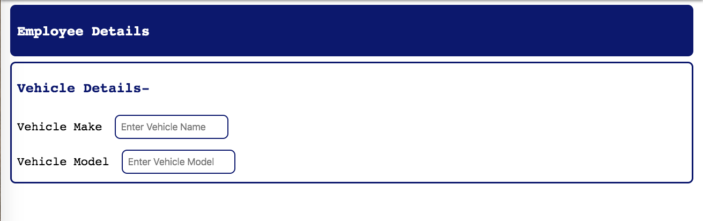
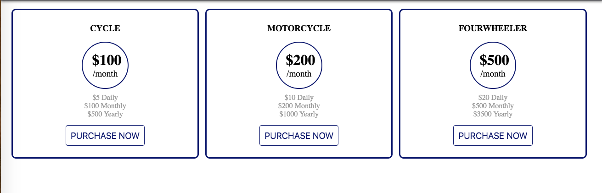

# Problem Statement

### NOTE
- This assignment is the extended part of the Assignment 1 (HTML) - you need to style the things created in the previous assignment.
- Both HTML & CSS will be required for this assignment.
- Write reusable style rules.
- Add meaningful class names & use the same in CSS with proper arrangement.
- Add comments wherever possible to make the code more readable.
- Try to maintain a theme with consistent background & foreground colors & equally spaced elements.	

### Assume a Metacube Parking System. 
1. Style the landing page as given earlier. Give some style according to your choice to the navbar you created in the previous assignment. There will be 4 navigation items - 
    - Add Employee
    - Add Vehicle
    - Give feedback
    - Pricing

You must have added a cover image in the previous assignment. Add some style to that if you want.  
Below the image there will be 4 regions one after the other corresponding to the four navigation items.  
On click of each navigation item, the page should scroll automatically to the corresponding region (so that it can be used instantaneously) and works actually as a navigation item.

2. Below image you added “employee” & “vehicle” regions. Style the “employee” and the “vehicle” region containing their respective fields as a collapsible component (with both expanded & collapsed state) as shown in the reference image below

Image shows “Employee” region in collapsed form & “vehicle” region in expanded form (with different color & background depending on the state). Just need to add style to depict expanded & collapsed state toggle just by adding a particular class. (As explained in the session).  
Regions should have all the fields as given in the previous assignment. You can style the fields according to your wish to make it more intuitive but keeping the base style.

“Employee” region has following fields :-
    - Full Name
    - Gender
    - Email Id
    - Password
    - Confirm Password
    - Contact Number

“Vehicle” region has following fields :-
    - Vehicle Make (Company)
    - Vehicle Model
    - Type
    - Vehicle Number
    - Employee Id
    - Identification (Textarea - Color, mark,visible accessory etc.)

You can add the JS click handler code if you want which is optional. 

3. After the “vehicle” region, “feedback” region should be added. Style the “feedback” section you created as you wish. Just a reference image is as follows :

NOTE: Try to get the style of the form according to the theme of the website.

4. After the “feedback” region, you added “pricing section”. Place each type of pricing section side by side (not as previous assignment one after the other vertically) as shown in the image below :-

Any more intuitive styles are welcome.

