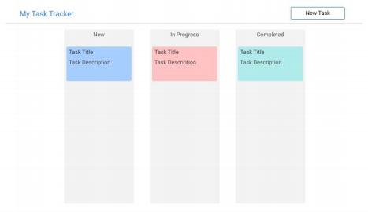

# Problem Statement

Create the frontend for a task management application.

- Users should be able to maintain tasks they need to do 
- Tasks have the following fields  (session-1)
    - Title 
    - Description 
    - Status 
    - Creation Date 
    - Completion Date 
    - Priority
- Tasks can have the following status values (session-1)
    - New 
    - In Progress 
    - Completed 
- Tasks can have following priority values (session-1)
    - High 
    - Medium 
    - Low 
- Tasks should be color coded by priority (session-1)
- Users can create (session-1), delete (session-2) and update (session-2) tasks 
- Create tasks with default status set to New (session-1)
- Completed tasks can only be viewed, no editing is allowed (session-2)
- Creating or editing a task should be done in a modal (session-2)
- Optionally implement Drag and drop functionality to update task status. eg: User can drag and drop a task card from New tasks lane to In Progress task lane (session-2)