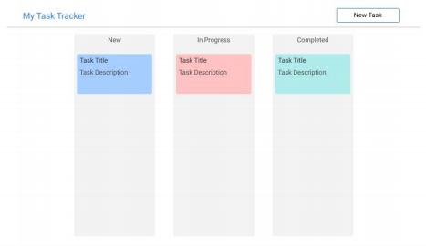

# Problem Statement

Create the frontend for a task management application. 

- Users should be able to maintain tasks they need to do 
- Tasks have the following fields 
    - Title
    - Description
    - Status
    - Creation Date
    - Completion Date 
    - Priority
- Tasks can have the following status values 
    - New
    - In Progress
    - Completed
- Tasks can have following priority values 
    - High
    - Medium
    - Low
- Tasks should be color coded by priority 
- Users can create, delete and update tasks 
- Create tasks with default status set to New 
- Completed tasks can only be viewed, no editing is allowed 
- Creating or editing a task should be done in a modal 
- Optionally implement Drag and drop functionality to update task status. eg: User can drag and drop a task card from New tasks lane to In Progress task lane