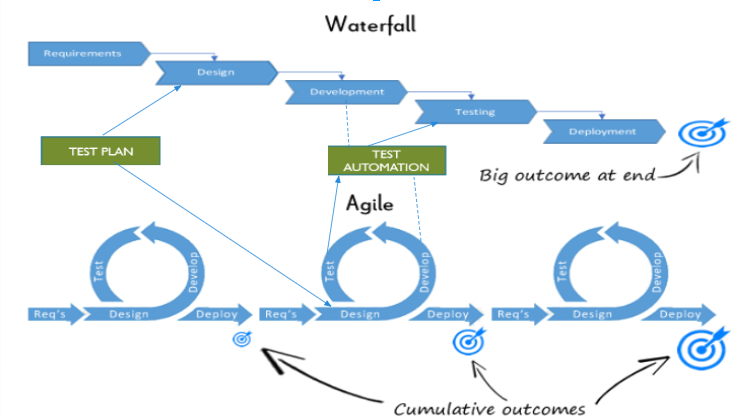

# Test Automation

#### Which software development technique is good for the systems that have third party API calls, cron jobs, data exports/imports, etc.,

TDD is advantageous for systems with third-party API calls, cron jobs, and data exports/imports because it promotes early detection of issues, improves code quality, facilitates refactoring, and serves as documentation. By ensuring that tests are written first, TDD helps create a robust and maintainable codebase that can adapt to changes and integrate effectively with external systems.

#### Where does Test Automation fit in the Software Life Cycle? Explain with a diagram.

Test automation fits into the software life cycle primarily during the Testing Phase, but it can also influence earlier phases like Development and Design.
In Agile Methodology it can be integrated right after the development of a module and through this small scale goal can be tested and thoroughly check at initial level itself .Here’s a simplified diagram:

#### Can we skip the manual testing and why?

While test automation can significantly reduce the need for manual testing, it is generally not advisable to skip manual testing entirely. Manual testing is essential for exploratory testing, usability testing, and scenarios that are difficult to automate. Automated tests can miss issues that a human tester might catch, such as user experience problems or edge cases.

#### Give the names of the selector(locators) ?

Common types of selectors (locators) used in test automation include:
- ID: driver.findElement(By.id("elementId"))
- Name: driver.findElement(By.name("elementName"))
- Class Name: driver.findElement(By.className("className"))
- Tag Name: driver.findElement(By.tagName("tagName"))
- CSS Selector: driver.findElement(By.cssSelector("cssSelector"))
- XPath: driver.findElement(By.xpath("xpathExpression"))

#### What is the modular framework? 

A Modular Framework is a test automation framework that divides the application under test into smaller, manageable modules. Each module is tested independently, and the tests can be reused across different test cases. This approach promotes reusability and maintainability of test scripts.

#### Explain the Open source tool.

Open Source Tools are tools which are free to avail and are developed by open source community.An example of an open-source tool is Selenium. Selenium is widely used for automating web applications for testing purposes. It supports multiple programming languages and browsers, making it a versatile choice for test automation.

#### What is a Hybrid framework?

A Hybrid Framework combines features of both data-driven and keyword-driven frameworks. It allows for the flexibility of using both approaches, enabling testers to create more complex and maintainable test scripts. This framework can handle various types of testing scenarios effectively.

#### Write a name of record and replay tool.

Selenium IDE (Integrated Development Environment) is a popular tool for automating web applications. It is particularly known for its record-and-replay functionality, which allows users to create automated test scripts without extensive programming knowledge. 

#### What is the difference between BDD and Cucumber?

> BDD (Behavior-Driven Development) is a software development approach that encourages collaboration between developers, QA, and non-technical stakeholders. It focuses on the behavior of the application from the end-user's perspective.

> Cucumber is a tool that supports BDD. It allows writing test cases in a natural language format (Gherkin), making it easier for non-technical stakeholders to understand and contribute to the testing process.

#### Can we replace the Manual Regression testing effort from Test automation and how?

Yes, test automation can replace a significant portion of manual regression testing. Automated tests can be run frequently and consistently, ensuring that existing functionality is not broken by new changes. To achieve this, organizations should:
- Identify stable test cases that are suitable for automation.
- Use automation tools to create and maintain these tests.
- Regularly run automated tests as part of the CI/CD pipeline.

#### How many ‘A’s test script has? Explain them.
The "A's" often refer to the Three A's of test automation:
- Arrange: Set up the necessary preconditions and inputs for the test.
- Act: Execute the action or function being tested.
- Assert: Verify that the expected outcome matches the actual outcome.
These steps help structure automated test scripts for clarity and effectiveness.
