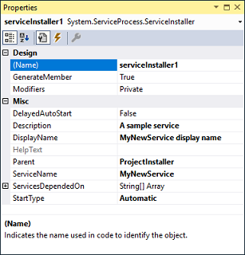

# Assignment

We can change many properties of our service.

- Display Name
- Service Name
- Description
- StartType



### Info

The Service Name is a unique identifier for the service within the Windows operating system. It is used by the system to manage the service and is typically not user-friendly.

<br>

The Display Name is a more user-friendly name that is shown in the Windows Services management console (services.msc) and other user interfaces.

<br>

Description is a brief summary about the service.

<br>

StartType tells us how the service will start(auto, manual) etc.

```bash
sc.exe [<servername>] create [<servicename>] [type= {own | share | kernel | filesys | rec | interact type= {own | share}}] [start= {boot | system | auto | demand | disabled | delayed-auto}] [error= {normal | severe | critical | ignore}] [binpath= <binarypathname>] [group= <loadordergroup>] [tag= {yes | no}] [depend= <dependencies>] [obj= {<accountname> | <objectname>}] [displayname= <displayname>] [password= <password>]
```